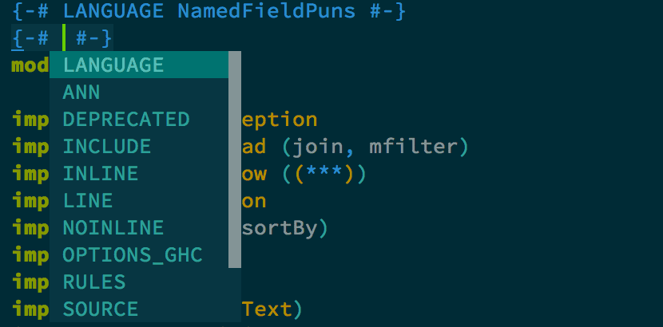
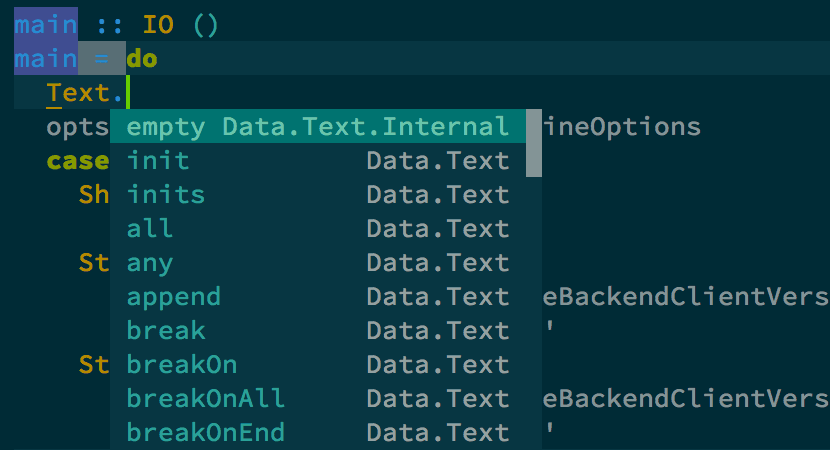
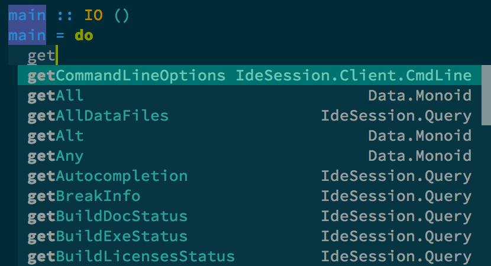
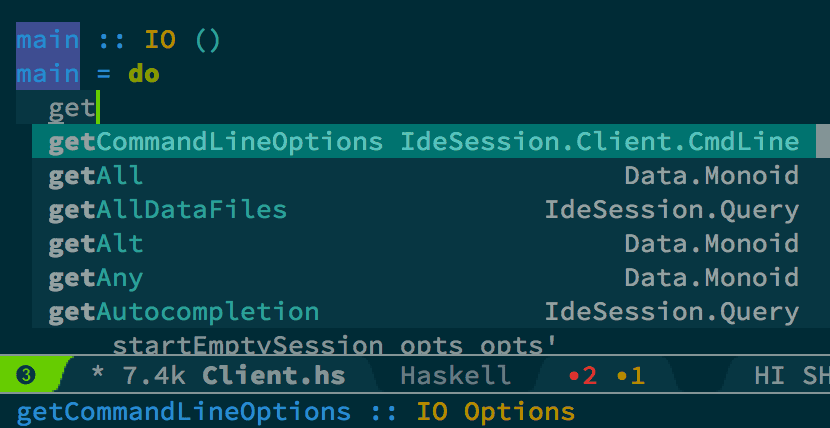

Company ide-backend
===================

[![License GPL 3][badge-license]][copying]

Overview
--------

[Company-mode][] completion back-end for [haskell-mode][] via [ide-backend-mode][].
It runs when the major mode is derived from [haskell-mode][].
This mode is based on the excellent [company-ghc][] by Iku Iwasa.

Installation
------------

### Depends

-   cl-lib
-   [company-mode][Company-mode]
-   [ide-backend-mode][]

    In order for `company-ide-backend` to work, `ide-backend-mode` has to be available and running. This is best done by calling `ide-backend-mode-start`.

Setup from [MELPA][]
--------------------
Note: This package is currently not available on MELPA, please use the git method for now.

### Setup from Git

1.  Install from Git:

        git clone https://github.com/Codas/company-ide-backend.git

2.  Add `company-ide-backend` to `company-backends` after loading [company-mode][Company-mode] and [ide-backend-mode][].

    ``` emacs-lisp
    (add-to-list 'load-path "/path/to/company-ide-backend")
    (add-to-list 'company-backends 'company-ide-backend)
    ```

    Or when using [spacemacs][]:

    ``` emacs-lisp
    (add-to-list 'load-path "/path/to/company-ide-backend")
    (setq-default dotspacemacs-excluded-packages '(company-ghc))
    (spacemacs|add-company-hook haskell-mode)
    (push '(company-ide-backend) company-backends-haskell-mode)
    ```

Feature
-------

### Completion

The following completions are available.

1.  Pragma names.

    

2.  Qualified imported keywords.

    

3.  Keywords from imported modules.

    

### Show type info in minibuffer

-   Type information for certain completion candidates are displayed in the minibuffer. Currently, ide-backend only supplies type information for completion candidates if they are actively used in the current module or defined in the current cabal project.

    

### Show module name as annotation

-   Module name is displayed as completion annotation if `company-ide-backend-show-module` is non-nil (default) as in the above images.

Note
----

-   Currently, company-ide-backend treats all symbols as completion prefix unless it starts from line beginning. This means other back-ends after company-ide-backend have no chance to provide completion candidates in haskell-mode.

    As of now, if you want to use other back-ends with company-ide-backend, use grouped back-end like below.

    ``` emacs-lisp
    (add-to-list 'company-backends '(company-ide-backend :with company-dabbrev-code))
    ```

-   `company-ide-backend` does not automatically reload the current file or interacts in any other way with [ide-backend-mode][] except to gather completion candidates. In order to reload the current file, call `ide-backend-mode-load`.
-   This mode is based on the excellent [company-ghc][] by Iku Iwasa. It is however not a fully functional replacement, as many more advanced features like import module completions, etc. are currently not available.

License
-------

Licensed under the GPL 3+ license.

[badge-license]: https://img.shields.io/badge/license-GPL_3-green.svg?dummy
[COPYING]: https://github.com/Codas/company-ide-backend/blob/master/COPYING
[Company-mode]: http://company-mode.github.io/
[haskell-mode]: https://github.com/haskell/haskell-mode
[ide-backend-mode]: https://github.com/chrisdone/ide-backend-mode
[company-ghc]: https://github.com/iquiw/company-ghc
[MELPA]: http://melpa.milkbox.net/
[spacemacs]: https://github.com/syl20bnr/spacemacs
